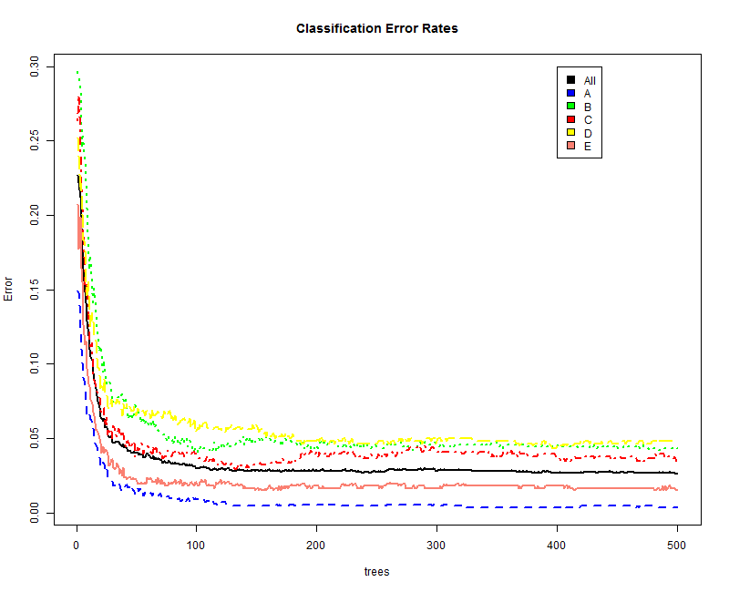

# Introduction
The purpose of this project is to predict whether a set of exercises have been performed correctly using sensor data from a six subject study in which the participants performed various exercises correctly and incorrectly.  Each exercise was classified based on whether it was performed correctly or not, and the type of error that was made.  The subjects were fitted with 4 sensors in a glove, armband, belt on on a dumbell that recored the movement during exercise. 

`R` code evaluation functionality is not enabled in this write-up because of the time it takes to run the various code blocks.  Functional code is proved in the an [R script available](http://asifsalam.github.io/PracticalML_Project/Main_Script.R) in the repository.


# Data Exploration
The training data consists of 19622 observations or unique exercises performed, and 160 fields of sensor data.  A number of these are identifiers and time stamps (columns 1-7). 67 fields consist of mainly NA values, and 33 have mainly blank spaces with a few values.  These have been removed from both the training and test data sets.  The steps taken to clean up the data are as follows:

1) Create function to count the number of NA values in a column
2) Create a vector of column numbers to remove, start with 1:7, which are identifiers and time stamps (7)
3) Identify and add those columns which have NA values (67)
4) Identify and add character columns (33)
5) Convert the classifer (classe) to Factor

The code used for the analysis is available in the associated github repository.


```
# Function to count number of NA values in a column
na_count <- function(x) {
    sum(is.na(x))
}

# Identify columns to remove
# 1. Identifiers and time stamps
rm_cols <- 1:7

# 2. Columns with missing values
missing_values <- apply(raw_training,2,na_count)

var_names <- names(missing_values)
var_valid <- data.frame(var_names=var_names,missing_count=missing_values,stringsAsFactors=FALSE)

rm_cols <- c(rm_cols,which(var_valid$missing_count>0))

# 3. Character columns, with lots of blank values
col_classes <- as.data.frame(lapply(raw_training,class))
chr_cols <- grep("character",t(col_classes))

# 4. Identify the columns to remove, and remove
rm_cols <- union(rm_cols,chr_cols[(chr_cols!=which(names(raw_training)=="classe"))])
training <- raw_training[,-rm_cols]
testing <- raw_testing[,-rm_cols]

# 5. Convert the classifier variable to factor
training$classe <- as.factor(training$classe)
```


#  Model Creation

A random forest model was used for this classification task.  The `train` function from the `caret` package took a significant amount of time, so the **`randomForest`** function from the `randomForest` package was used.  **5 fold cross validation** was used to assess the performance of the model.
  
The algorithm for the cross validation is described below, encapsulated within a function.


```
# Function to estimate model performance using cross-validation

get_performance <- function(training,training_folds,k=5) {
    
    # This is also used with different variable number, so that depends on the training set
    # Also expects the folds to be included, and a default of 5 folds
    n_vars <- ncol(training) -1
    
    # returns the variable importance, and various model paramenter, inlcuding out of sample
    # error rates
    var_imp <- data.frame(temp=rep(NA,n_vars),stringsAsFactors=FALSE)
    model_vars <- data.frame(i=integer(),nvars=integer(),m_try=integer(),n_tree=integer(),
                             in_error=numeric(),out_error=numeric())
    
    for (i in 1:k) {
        print(paste("Run : ",i,"Training Model"))
        
        # Create training & test sets
        trainx <- training[-training_folds[[i]],]
        testx <- training[training_folds[[i]],]
        
        # fit the model
        model_fit <- randomForest(x=trainx[,-(n_vars+1)],y=trainx[,"classe"])
        print("Done")
        
        # Calculate and save parameters
        pred_train <- predict(model_fit,trainx)
        in_error <- 1- sum(pred_train==trainx$classe)/nrow(trainx)
        pred_test <- predict(model_fit,testx)
        out_error <- 1 - sum(pred_test==testx$classe)/nrow(testx)
        model_vars[i,] <- c(i,n_vars,model_fit$mtry,model_toy$ntree,in_error,out_error)
        temp <- paste0("var",i)
        var_imp[,temp] <- rownames(model_fit$importance)
        temp <- paste0("rank",i)
        var_imp[,temp] <- model_fit$importance
        
    }
    
    # Calculate average model performance
    var_imp$weights <- rowSums(var_imp[,c(3,5,7,9,11)])
    var_imp <- var_imp[,c("var1","weights")]
    var_imp <- var_imp[order(var_imp$weights,decreasing=TRUE),]
    model_perf <- mean(model_vars$out_error)
    
    return(list(model_perf=model_perf,var_imp=var_imp,model_vars=model_vars,model_fit=model_fit))
}


# Create the folds for cross-validation
training_folds <- createFolds(training$classe,k=5)
# establish baseline performance of the model.
baseline <- get_performance(training,training_folds,5)

```
```
baseline$model_perf
[1] 0.004076862

baseline$model_vars
  i nvars m_try n_tree in_error   out_error
1 1    52     7    500        0 0.003312946
2 2    52     7    500        0 0.002549070
3 3    52     7    500        0 0.005605096
4 4    52     7    500        0 0.002292994
5 5    52     7    500        0 0.006624204

```
  
    

The average misclassification error of the five models is around **0.4%**, with a maximum of **0.6%**.  The above function was also used to assess the number of variables that could be removed while maintaining reasonalby good performance (around 0.5% misclassification).  Reducing the variables reduces over fitting and improves out of sample performance, if the variables have no real predictive value.  

In order to assess how many variables could be reasonable used, the variables were first ranked in order of importance from the model, and progressively increased from a minimum value of **5**. I ended up using **20 variables**.  The code used for this was as follows:  
  

```
# Initialize variable to save model parameters
model_vars <- data.frame(i=integer(),nvars=integer(),m_try=integer(),n_tree=integer(),
                         in_error=numeric(),out_error=numeric())


# Save variable ranks
var_ranks <- list()
var_imp <- data.frame(temp=rep(NA,52),stringsAsFactors=FALSE)

for (i in 1:5) {
    # the number of variables included in the training set
    
    trainx <- training[training_folds[[i]],]
    testx <- training[training_folds[[sample(c(1:5)[-i],1)]],]
    model_fit2 <- randomForest(x=trainx[,-53],y=trainx[,"classe"])
    pred_test <- predict(model_fit2,testx)
    out_error <- 1 - sum(pred_test==testx$classe)/nrow(testx)
    model_vars[i,] <- c(i,n_vars,model_fit2$mtry,model_fit2$ntree,out_error)
    temp <- paste0("var",i)
    var_imp[,temp] <- rownames(model_fit$importance)
    temp <- paste0("rank",i)
    var_imp[,temp] <- model_fit2$importance
}

# rank the most important variables, and sort accordingly
var_imp$weights <- rowSums(var_imp[,c(3,5,7,9,11)])
var_ranks <- var_imp[,c("var1","weights")]
var_ranks <- var_ranks[order(var_ranks$weights,decreasing=TRUE),]

# Use teh most important variables, and estimate the minimum number of variables
# that give a reasonable performance (around 0.5% misclassification)

use_vars <- c(var_ranks[1:45,1],"classe")
training_folds <- createFolds(training$classe,k=5)
model_perf <- data.frame(n_vars=integer(),perf=numeric())
for (i in 1:10) {
    n_vars <- i*5
    use_vars <- c(var_ranks[1:n_vars,1],"classe")
    test_model <- get_performance(training[,use_vars],training_folds,5)
    model_perf[i,] <- c(i*5,test_model$model_perf)
}

```

```
print(model_perf)
   n_vars        perf
1       5 0.029660843
2      10 0.013607005
3      15 0.011313777
4      20 0.005605953
5      25 0.005249187
6      30 0.004943389
7      35 0.004535655
8      40 0.004280904
9      45 0.003975107
10     50 0.003618406

```


This shows that the performance of the model is acceptable at around 20 of the most significant variables.  This is what is used for the model, as shown in the code snippet below.  The `var_ranks` variable has all the variables stored in rank of importance, the first 20 of which were used for the final model used for the test set.

This figure shows the variable importance based on a model with all the variables.


(It seems like around 15 variables would have done the job as well.)

```
# Final result
use_vars <- c(var_ranks[1:20,1],"classe")
train_x <- training[,use_vars]
model_fit <- randomForest(x=train_x[,-21],y=train_x[,"classe"])
test_y <- testing[,c(use_vars[1:20],"problem_id")]
test_prediciton <- predict(model_fit,test_y)
print(test_prediction)

```
```
Call:
 randomForest(x = train_x[, -21], y = train_x[, "classe"]) 
               Type of random forest: classification
                     Number of trees: 500
No. of variables tried at each split: 4

        OOB estimate of  error rate: 0.42%
Confusion matrix:
     A    B    C    D    E  class.error
A 5575    4    0    0    1 0.0008960573
B   10 3771   16    0    0 0.0068475112
C    0   11 3406    5    0 0.0046756283
D    0    0   19 3194    3 0.0068407960
E    0    0    3   10 3594 0.0036041031
```

# Expected out of sample error

The model used uses 500 trees, sampling 4 variables at each split, and an estimated classification error rate less than **0.5%**.

Based on the cross validation and the model selected, the out of sample error is expected to be less than 1% (misclassification).  This figure shows the classification error rates for this model based on the number of trees.



# Choices

Preliminary exploration of the data did not show any separable patterns, and it seemed that the relationship between the predictors and the class would be non-linear.  Random Forest seemed to be the appropriate chose.  It was also one of the models that was explained in the lectures, obviously!  I tried to explore ways of selecting the number of variables to sample, and the number of trees to grow as well, but this turned out to be quite time consuming.  The code exists in the script.  Around 10 variables, and about 350 trees seemed to perform reasonably well, but it would have taken much more time to put all the components together.  So for this write-up, I used the default settings in the `randomForest` function.

The explanation of how to enable all the cores for parallels processing was a life-saver for me.  Without that piece of advice, there was no way I would have been able to complete the amount of runs required.
